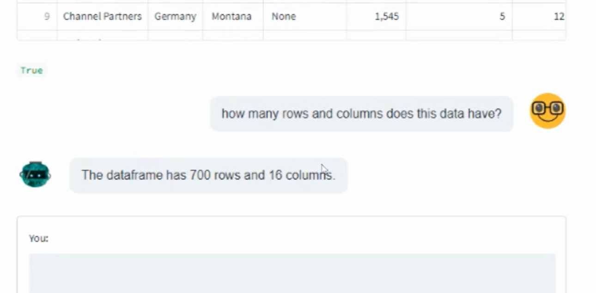

# Chat with CSV

Chat with CSV is a prototype application written to demonstrate the use of Natural Query Language generated by OpenAI and Langchain to chat with your data.
The folowing python libraries are used
- OpenAI (For creating embeddings)
- Langchain (Python framework for developing apps powered by LLM)
- Streamlit (Frontend UI for the chatbot)





## Table of Contents

- [Installation](#installation)
- [License](#license)
- [Acknowledgements](#acknowledgements)

## Installation

- Prerequisites
1. Clone this repo
2. Create the python virtual environment inside the cloned directory
```console
cd chatwithcsv
pipenv shell

3. Install the pre-requisite 

```console
pip install -r requirements.txt
```

- How to run the project
```console
cd chatwithcsv
pipenv shell
streamlit run app.py
```

## License

MIT License

Copyright (c) [2023] [Biju Krishnan]

Permission is hereby granted, free of charge, to any person obtaining a copy of this software and associated documentation files (the "Software"), to deal in the Software without restriction, including without limitation the rights to use, copy, modify, merge, publish, distribute, sublicense, and/or sell copies of the Software, and to permit persons to whom the Software is furnished to do so, subject to the following conditions:

The above copyright notice and this permission notice shall be included in all copies or substantial portions of the Software.

THE SOFTWARE IS PROVIDED "AS IS", WITHOUT WARRANTY OF ANY KIND, EXPRESS OR IMPLIED, INCLUDING BUT NOT LIMITED TO THE WARRANTIES OF MERCHANTABILITY, FITNESS FOR A PARTICULAR PURPOSE AND NONINFRINGEMENT. IN NO EVENT SHALL THE AUTHORS OR COPYRIGHT HOLDERS BE LIABLE FOR ANY CLAIM, DAMAGES OR OTHER LIABILITY, WHETHER IN AN ACTION OF CONTRACT, TORT OR OTHERWISE, ARISING FROM, OUT OF OR IN CONNECTION WITH THE SOFTWARE OR THE USE OR OTHER DEALINGS IN THE SOFTWARE.


## Acknowledgements

Most of the code is borrowed from the following
https://python.langchain.com/en/latest/modules/agents/toolkits/examples/pandas.html
https://github.com/marshmellow77/streamlit-chatgpt-ui/blob/main/app.py